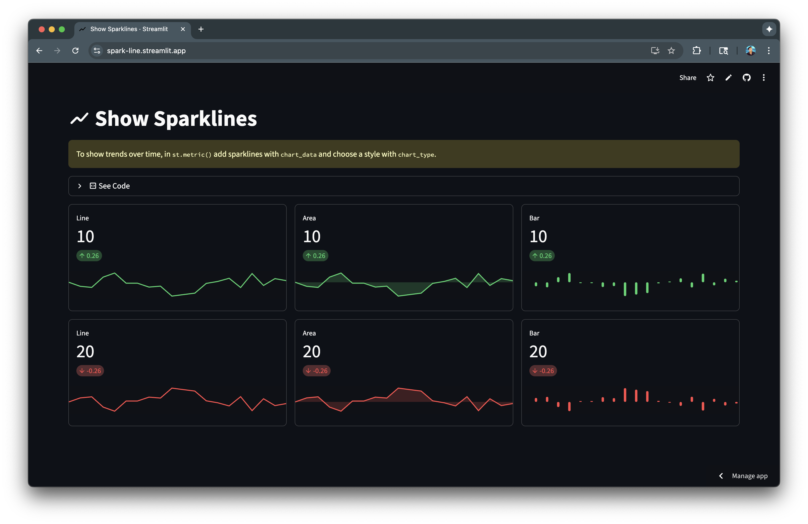

# 📈 Sparkline demo

Demo app of sparkline in action. To show trends over time, add sparklines with the `chart_data` parameter for `st.metric()`.

## Demo App

## GitHub Codespaces

## Resources

- [st.metric](https://docs.streamlit.io/develop/api-reference/data/st.metric)
